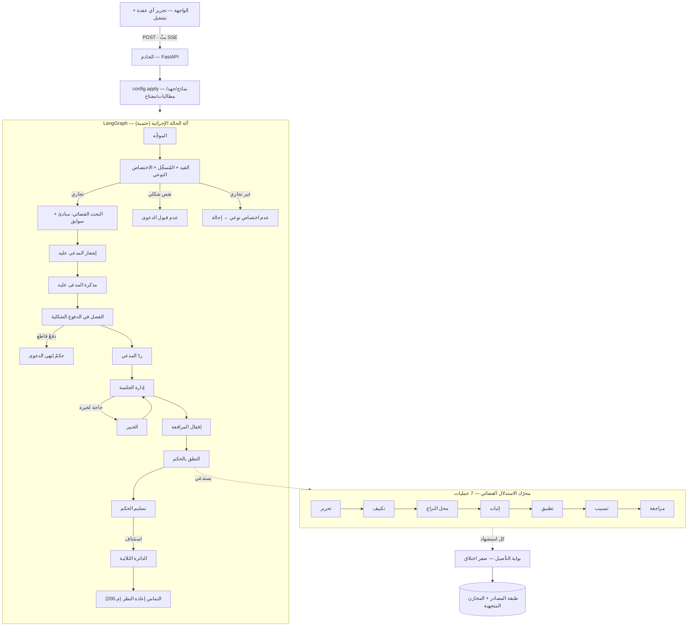

# بيّن (Bayyin) — محاكاةُ القضاء التجاري السعودي بوكلاء متعدّدين

> ⚠️ **محاكاةٌ تدريبية فقط** — ليست حكماً قضائياً حقيقياً ولا استشارةً قانونية. على المحامي التحقّق من كل إسنادٍ نظاميٍّ قبل الاعتماد عليه.

نظامٌ يحاكي سيرورة التقاضي أمام **المحكمة التجارية السعودية** (المرحلة الابتدائية ← الاستئناف ← التماس إعادة النظر) ليتدرّب القضاة والمحامون والطلبة على قضاياهم في بيئةٍ آمنة، بنماذج OpenAI وتنسيق LangGraph.

---

## المبدأ الحاكم

> **الإجراء القضائي = كودٌ حتمي. المحتوى القانوني = نموذجٌ لغويٌّ مُسنَدٌ بمصدرٍ مُتحقَّقٍ منه.**

- **تسلسل الإجراء** والمواعيد وقابلية الاعتراض تُحسَم بقواعدَ بالكود قابلةٍ للتدقيق (`rules.py`) — لا يقرّرها نموذج.
- **المحتوى** (المذكرات، التكييف، التسبيب، المنطوق) يولّده النموذج **مُلزَماً بالاستشهاد** من مصادر `file_search`.
- **بوابة صفر-اختلاق**: كل استشهادٍ يُعرَض على طبقة المصادر (`sources.py`)؛ فلا يَعبُر إلى الحكم ما لا يُسنَد إلى مصدرٍ معروفٍ، ولا اقتباسُ مبدأٍ/سابقةٍ لا يطابق نصاً مُسترجَعاً فعلاً.

---

## معمارية الوكيل (نظرة عامة)



النظام أربعُ طبقاتٍ متعاونة:

| الطبقة | المسؤولية | الملفّات |
|---|---|---|
| **التنسيق** | آلة حالةٍ إجرائية حتمية (LangGraph) — لا تُتخطّى خطوة، وكل انتقالٍ محفوظ بـ checkpoint | `graph.py`, `nodes.py` |
| **الوكلاء** | أدوارٌ نموذجية: موجِّه، مُسجِّل، هيئة بحث، مدعى عليه، خبير، قاضٍ، دائرة استئناف | `nodes.py`, `panel.py`, `research.py`, `prompts.py` |
| **الاستدلال** | محرّك القاضي: سبع عملياتٍ مُقيَّدة، كلٌّ يتبعها مُتحقِّقٌ حتميٌّ سعودي | `operators.py`, `procedure.py` |
| **التأصيل** | «القانون كبيانات»: التحقّق من كل إسنادٍ ومطابقتُه للمسترجَع (صفر اختلاق) | `sources.py`, `citations.py`, `tools.py` |

---

## محرّك الاستدلال القضائي (قلب النظام)

النطق بالحكم ليس «نموذجاً يملأ نصاً»، بل سلسلةٌ من **سبع عملياتٍ** كلٌّ منها = توليدٌ مُقيَّد + مُتحقِّقٌ حتميٌّ سعودي:

1. **التحرير** — تحديد الطلبات والصفة والمصلحة.
2. **التكييف** — طبيعة النزاع والنظام الحاكم (يستشهد بالمبادئ القضائية المُسترجَعة).
3. **تحديد محل النزاع** — تمييز المتّفق من المتنازَع، وإحصاء الدفوع الجوهرية.
4. **الإثبات** — عبء الإثبات لكل نقطة (البيّنة على من ادّعى) وهل ثبتت.
5. **التطبيق** — إنزال القاعدة النظامية على الوقائع الثابتة.
6. **التسبيب والمنطوق** — ربط الأسباب بالمنطوق.
7. **المراجعة** — فحصٌ بمنطق الاستئناف.

**المُتحقِّقات الحتمية** (تُقابِل أسباب المادة 200):
- `check_non_ultra_petita` — لا يُقضى بما لم يُطلب ولا بأكثر منه.
- `check_mantuq_consistency` — لا تناقض بين التسبيب والمنطوق.
- `check_defenses_addressed` — الردّ على كل دفعٍ جوهري.

أيُّ مخالفةٍ جوهرية (⛔: اختلاقٌ في الإسناد، أو قضاءٌ بما لم يُطلب، أو تناقضٌ) **تحبِس النطق** فلا يصدر حكمٌ موضوعيٌّ مبنيٌّ على خلل.

---

## التأصيل ومكافحة الهلوسة القانونية

- **طبقة المصادر** (`sources.py`): الأنظمة السعودية المعروفة + نواةٌ من المواد المؤصَّلة. `verify_cite` يصنّف كل إسناد: `مؤصَّل / اجتهاد شرعي / غير مُحمَّل / مختلق`.
- **المبادئ والسوابق التجارية**: مصادرُ مرجعها الاسترجاع الحيّ — لا تُعدّ مؤصَّلةً إلا إذا **طابق اقتباسُها نصاً مُسترجَعاً فعلاً** من `file_search` (لا يكفي أن يكون الاقتباس غير فارغ).
- **بوابة صفر-اختلاق** (`assess_grounding`): تَلزم ≥ 1 إسنادٍ مؤصَّل و **صفر مختلق** لإصدار الحكم.

## طبقة البحث القضائي (المبادئ والسوابق)

تُجرى مرّةً بعد القبول وقبل المرافعة (`research.py`):
- **نداء المبادئ + الأنظمة** → المرجع التأصيلي **القابل للاستشهاد** (يستشهد به القاضي).
- **نداء السوابق** (مخزنا السوابق معاً) → **توجيهٌ استئناسيٌّ تحليلي** يُثري الدفوع ويعاير التوقّعات، **دون أن يقيّد القاضي**.

> روح القضاء السعودي: المبادئُ تأصيلٌ راجح، والسوابقُ استئناسٌ لا إلزام. لذلك تُحجَب «إشارة اتجاه السوابق» عن سياق القاضي تفادياً للإرساء (anchoring)، وتبقى للعرض ولوكيل الخصم.

## التخصّص التجاري

النظام **تجاريٌّ فقط**. ما خرج عن الاختصاص النوعي للمحكمة التجارية تحكم فيه بـ**عدم الاختصاص النوعي وإحالته** للجهة المختصّة (لا ردّاً شكلياً — تُنقل الخصومة وتبقى آثار رفعها).

---

## الوعي الزمني والتحرير وإعادة التشغيل

- **زمنيّاً**: لكل إجراءٍ تاريخٌ هجريٌّ/ميلاديٌّ تقديري ومهلٌ نظامية (`timeline.py`)، مع عرضٍ كتقويم.
- **التحرير**: عدّل نصّ أي وكيل ثم أعد التشغيل — نصّك يستبدل نصّ النموذج (override) فيتغيّر مسار القضية.
- **التخزين التدريجي** (`CachingLLM`): تعديلُ عقدةٍ وإعادةُ التشغيل يُعيدان حساب **المتأثّر بالتعديل فقط**؛ وما لم تتغيّر مدخلاته يعود **فوراً ومجّاناً** من الكاش (مفتاحه = بصمة المحتوى). زرّ «🔄 توليد جديد» يتجاهل التخزين.
- **تصدير الصكّ**: زرٌّ في بطاقة الحكم يُصدّره ملفّ **Word (DOCX)** منسّقاً بالعربية (الوقائع/الأسباب/المنطوق + سلسلة الاستدلال والإسنادات).
- **مرونة الوضع الحقيقي**: إعادةُ محاولةٍ بتراجعٍ أُسّيٍّ عند أخطاء API العابرة، فلا يُجهِض خللٌ عابرٌ التشغيل.

> الاستئناف يخضع لبوابة التأصيل نفسها: حكم الدائرة النهائي يحمل ثقةً وإسناداتٍ مُتحقَّقة ويُحبَس عند الاختلاق — كحكم أول درجة.

## النماذج والجهد

| الطبقة | الافتراضي | الجهد |
|---|---|---|
| الموجِّه | `gpt-5.4-mini` | — |
| الوكلاء القياسيون | `gpt-5.5` | — |
| المتقدّم | `gpt-5.5` | — |
| القاضي | `gpt-5.5` | **high** |

كلّها قابلةٌ للتعديل من **صفحة الإعدادات ⚙️** (مفتاح OpenAI، النموذج وجهد الاستدلال لكل طبقة، ومطالبات النظام) — وتُحفظ في المتصفّح فقط، وتُطبَّق لكل تشغيلٍ مستقلاً.

---

## التشغيل

```powershell
pip install -r requirements.txt

# الخادم والواجهة:
python -m uvicorn server:app --port 8010
# ثم افتح http://127.0.0.1:8010

# عرضٌ نصّي كامل (وضع وهمي، بلا API):
python run_demo.py

# الاختبارات الحتمية (بلا API):
$env:PYTHONUTF8=1 ; python -m pytest -q
```

**الوضع الحقيقي** يتطلّب `OPENAI_API_KEY` في ملفّ `.env` (غير مرفوعٍ — مُستثنى بـ`.gitignore`) أو إدخالَه في صفحة الإعدادات. فعّل «حقيقي» في الترويسة (`BAYYIN_MOCK=0`).

### متغيّرات البيئة
| المتغيّر | الأثر |
|---|---|
| `OPENAI_API_KEY` | مفتاح OpenAI (يُقرأ من `.env`) |
| `BAYYIN_MOCK=1` | تشغيلٌ بنماذج وهمية بلا أي نداء API |
| `BAYYIN_NO_CACHE=1` | تعطيل التخزين التدريجي |
| `BAYYIN_CACHE_DIR` | مجلّد الكاش (الافتراضي: مؤقّت النظام) |
| `BAYYIN_PG_DSN` | استخدام Postgres checkpointer بدل الذاكرة |

---

## بنية الملفّات

| الملف | الدور |
|---|---|
| `bayyin/graph.py` | آلة الحالة الإجرائية (LangGraph) |
| `bayyin/nodes.py` | سلوك كل دور (عُقَد) + القيد والاختصاص النوعي + إعادة البحث |
| `bayyin/research.py` | طبقة البحث القضائي (المبادئ + السوابق) |
| `bayyin/operators.py` | محرّك الاستدلال — 7 عمليات + المُتحقِّقات الحتمية |
| `bayyin/procedure.py` | الدفوع الشكلية كحقوقٍ تُمارَس (اختصاص/تقادم/عدم قبول/طلب عارض) |
| `bayyin/sources.py` | طبقة المصادر + التحقّق + بوابة صفر-اختلاق |
| `bayyin/citations.py` | بوابة استشهادٍ على مستوى المستندات (طبقةٌ مكمّلة) |
| `bayyin/panel.py` | دائرة الاستئناف الثلاثية (جولةٌ عمياء ثم مداولة) + بوابة التأصيل على الحكم النهائي |
| `bayyin/rules.py` | قواعد الإجراء الحتمية (تدقيق، قابلية اعتراض، م.200) |
| `bayyin/llm.py` | غلاف Responses API (بجهد الاستدلال + إعادة محاولةٍ عابرة) + النموذج الوهمي + التخزين التدريجي |
| `bayyin/export_docx.py` | تصدير صكّ الحكم إلى ملفّ Word (DOCX) بالعربية |
| `bayyin/tools.py` | بُناة أدوات `file_search` / `web_search` |
| `bayyin/prompts.py` · `config.py` · `settings.py` | المطالبات · إعدادات التشغيل (نماذج/جهد) · الإعدادات المركزية |
| `bayyin/state.py` · `timeline.py` · `audit.py` | حالة الدعوى · الوعي الزمني · سجلّ التدقيق |
| `server.py` · `web/index.html` | خادم البثّ (`/api/run` · `/api/config` · `/api/export`) · الواجهة التفاعلية |
| `tests/` | اختباراتٌ حتمية (وضع وهمي) — تغطّي المحرّك والقواعد والإجراء والتأصيل |

---

## تنبيهات دقّة

- المخرجات **محاكاةٌ تدريبية** لا أحكامٌ حقيقية ولا استشارةٌ قانونية.
- نواةُ المصادر جزئيةٌ موثّقة؛ المعوّل عليه تحميلُها من النصوص الرسمية (هيئة الخبراء/وزارة العدل/أم القرى).
- `uqn.gov.sa` = جريدة أم القرى الرسمية (لا منصّة المنافسات).
- في الوضع الحقيقي، التحقّقُ من مطابقة اقتباس المبدأ/السابقة للمسترجَع يتمّ في `sources.verify_cite` (مع نصوص `file_search`)؛ راجِع `CONTRIBUTING`/الشيفرة قبل أي اعتمادٍ إنتاجي.
